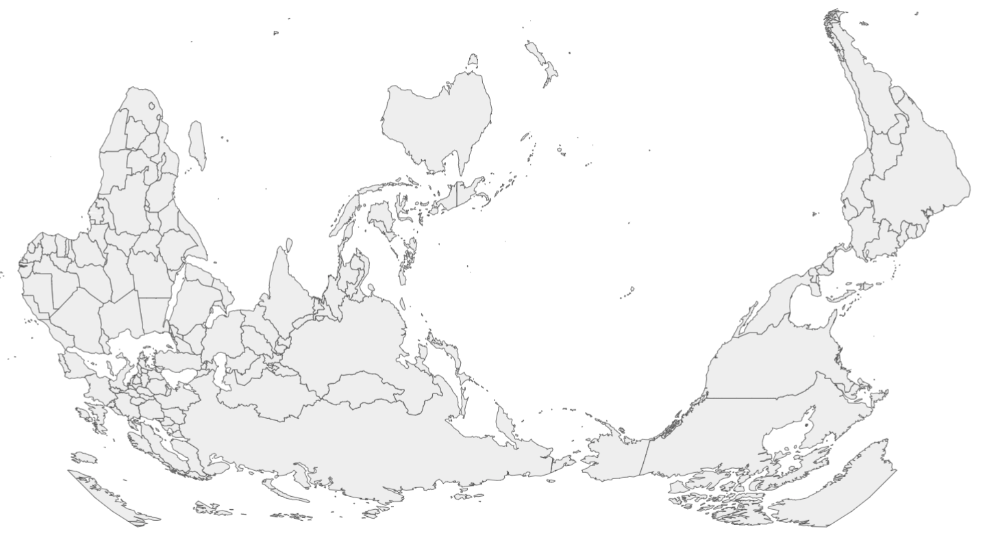

# 世界地图的视图中心点可以定制吗

!!! 已知问题

    地理坐标需要经过对应的转换才能正确显示。转换的方法还未研发。

## 准备

首先，你需要装：

1. node.js
1. [d3-geo-projection](../tools/d3-cli.md)
1. [echarts-mapmaker](../tools/mapmaker.md)

这个是简要命令：

    ```npm install -g d3-geo-projection echarts-mapmaker```

## 实际操作

1. 世界地图可以在这里找到 `node_modules/echarts/map/json/world.json`
1. 先解码 world.json，得到标准的 geojson.

    ```decode world.json world.geojson```

1. 开始先旋转一下

    ```geoproject 'd3.geoEcker3().rotate([-150,0,0])' < world.geojson > new-world.geojson```

    我们看看形状，倒了。

    


1. 翻一个个，好了：加上 `geoproject 'd3.geoIdentity().reflectY(true)`

    ```geoproject 'd3.geoEcker3().rotate([-150,0,0])' < world.geojson | geoproject 'd3.geoIdentity().reflectY(true)' > new-world.geojson```

    

    注意到没有，在红圈的地方，俄国联邦的车里雅宾斯克（Челябинск/Chelyabinsk) 有切割线。这就
    需要用到 `geostitch` 了。


1. 在运行 `geoproject` 之前，我们先把分隔的俄罗斯补起来。在做投影就可以了。

    ```geostitch world.geojson | geoproject 'd3.geoEcker3().rotate([-150,0,0])' | geoproject 'd3.geoIdentity().reflectY(true)' > new-world.geojson ```

    
