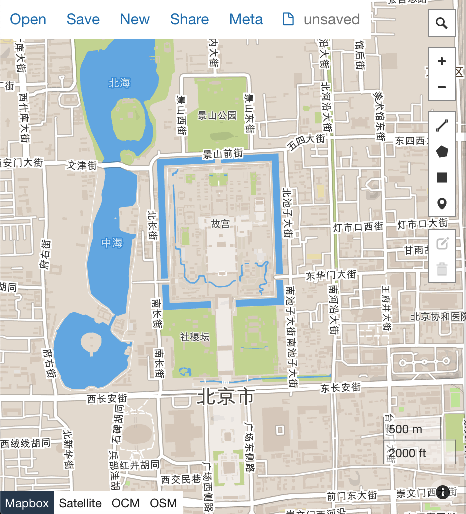
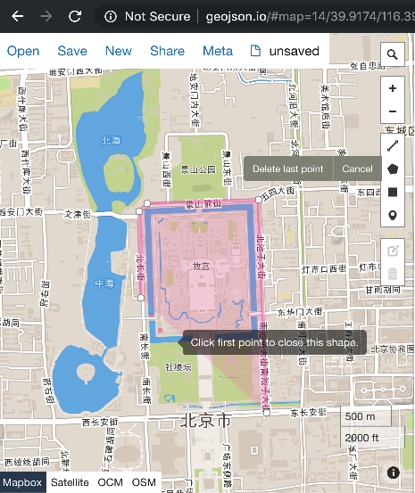
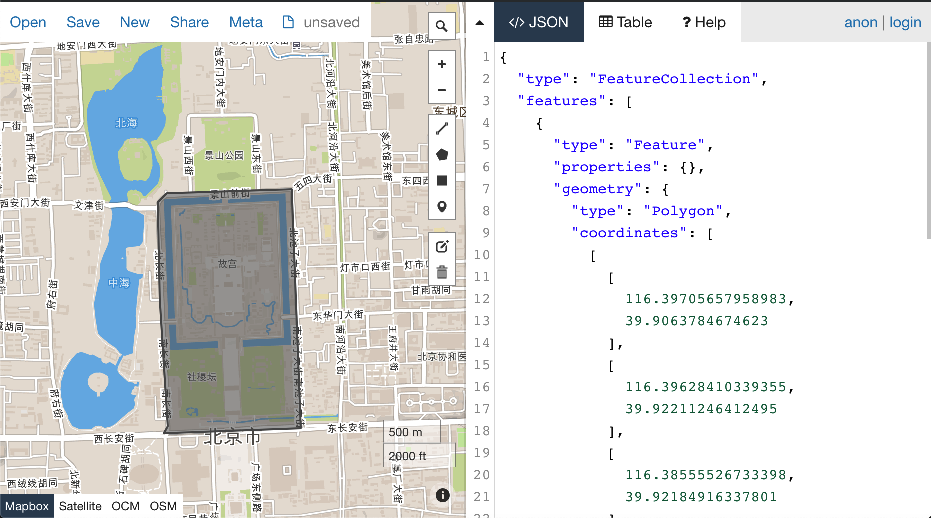

# 如何在 pyecharts 里展现自己画的地图形状

本教程的文件都存在了[github](https://github.com/echarts-maps/The-Forbidden-City-Demo)上。

## 画第一个多边形: 紫禁城

1. 在浏览器里打开 [geojson.io](http://geojson.io)

    

1. 找到北京并放大

    

1. 点击多边形工具，开始画图

    

1. 完成之前，一定要点击你画的第一个点

    

1. 把多边形合拢之后，在右边的文本框里，加上”紫禁城“

   ```"name": "紫禁城"

1. 然后存到本地为 "The-Forbidden-City-zh.geojson"


## 预览

再打开一个窗口，访问 [geojson.io](http://geojson.io) 。把本地的文件拽入
新的浏览器窗口。你应该可以看到自己刚才画的多边形。


## 下一步

我们要在 pyecharts 里渲染